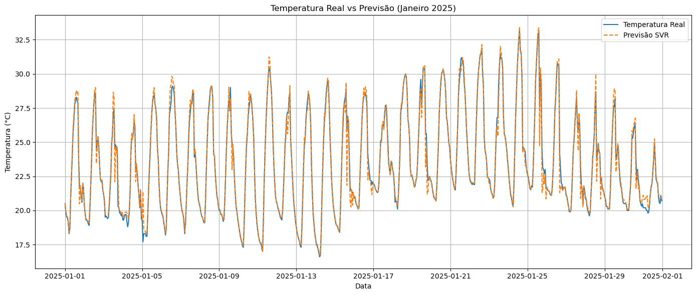
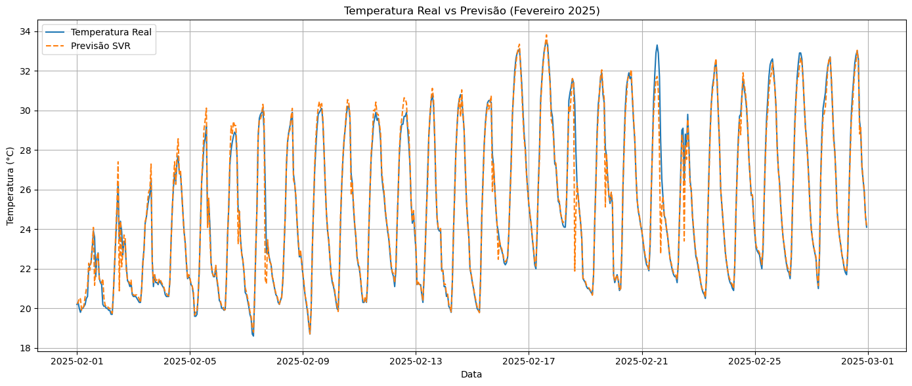
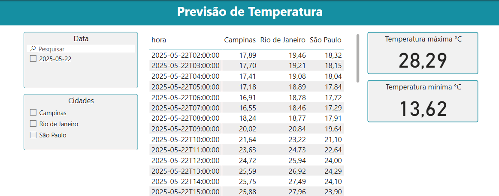

# 🌤️ Previsão de Temperatura com Machine Learning e AWS

Este projeto automatiza a previsão de temperatura para diferentes cidades, utilizando dados da API Open-Meteo, machine learning com Python e infraestrutura em nuvem da AWS. O resultado é visualizado em tempo real no Power BI através do Amazon Athena.

---

## 🚀 Tecnologias Utilizadas
O projeto foi desenvolvido através do AWS SAM CLI localmente.
- **Python + Jupyter Notebook** (pré-processamento e modelagem)
- **Docker** (Executar localmente funções lambda)
- **AWS S3** (armazenamento de dados e modelos)
- **AWS Lambda** (execução automatizada de previsões e gatilhos)
- **AWS Glue Crawler** (catálogo automático de dados)
- **Amazon Athena** (consulta SQL sobre dados particionados)
- **Power BI** (visualização dos resultados)
- **Open-Meteo API** (dados de clima abertos)

---

## 🧠 Funcionalidade do Projeto

1. **Extração de Dados**
   - Usa Jupyter para coletar dados históricos da Open-Meteo

2. **Modelagem**
   - Treina um modelo de machine learning (SVR) com features temporais
   - Salva o modelo e o scaler em um bucket S3

3. **Agendamento**
   - Um agendador do Windows executa a previsão semanalmente via script Python a cada 7 dias

4. **Execução da Previsão**
   - Um Lambda executa o modelo, gera previsões para 7 dias e salva no S3 em formato particionado (`data=` e `cidade=`)

5. **Atualização automática**
   - Outro Lambda escuta o S3 e dispara o Glue Crawler para atualizar o catálogo

6. **Consulta e Visualização**
   - Dados são consultados via Athena e visualizados no Power BI via ODBC

---

## Informações sobre a criação do modelo de machine learning:
1. Análise e coleta dos dados do open meteo salvo no bucket S3
2. Os dados utilizados no treinamento são do ano de 2024, totalizando 8784 registros.
3. A terceira etapa foi de treinamento e avaliação do modelo:

O modelo de previsão de temperatura foi treinado com as seguintes variáveis climáticas e temporais:

🌦️ Variáveis Climáticas:

relative_humidity_2m: Umidade relativa do ar a 2 metros de altura

apparent_temperature: Temperatura aparente considerando vento e umidade

precipitation: Volume de precipitação acumulado em um período

rain: Indicador binário de ocorrência de chuva

weather_code: Código que representa a condição climática

cloud_cover: Percentual de cobertura de nuvens

wind_direction_10m: Direção do vento a 10 metros de altura

wind_speed_10m: Velocidade do vento a 10 metros de altura

is_day: Indicador binário para diferenciar dia e noite

🕒 Variáveis Temporais Derivadas (Engenharia de Features):

hour_sin e hour_cos: Representam a hora do dia de forma cíclica, preservando periodicidade horária

month_sin e month_cos: Representam o mês do ano com sazonalidade cíclica

Essas variáveis derivadas ajudam o modelo a compreender padrões temporais sem introduzir ordinalidade indevida.

# Avaliação do modelo:
MAE (Erro Médio Absoluto): Mede o erro médio absoluto entre os valores reais e previstos. Quanto menor, melhor. Indica que o modelo, em média, erra 0.0950 unidades.

RMSE (Raiz do Erro Quadrático Médio): Mede o erro médio, penalizando mais fortemente erros maiores. Um RMSE de 0.1589 indica que os erros do modelo têm baixa magnitude.

R² (Coeficiente de Determinação): Mede o quanto da variabilidade dos dados o modelo consegue explicar. Um R² de 0.9990 mostra que o modelo explica 99,90% da variância dos dados — excelente desempenho.

MAPE (Percentual do Erro Médio Absoluto): Expressa o erro médio absoluto em termos percentuais. Um MAPE de 0.0042 (ou 0,42%) indica altíssima precisão nas previsões.

## 🗂️ Estrutura de Pastas
```
EXTRACT-DATA-FORECAST/
├── aws_lambda/              # Código da Lambda que gera previsões
│   ├── __init__.py
│   ├── predict_lambda.py
│   └── requirements.txt
├── events/
│   └── event.json           # Exemplo de evento de teste para a Lambda
├── load-data/
│   └── data-extract.ipynb   # Notebook para extrair dados históricos do Open-Meteo
├── ml/
│   ├── forecast_weather.ipynb
│   ├── scaler.pkl           # Scaler do modelo
│   └── svr_model.pkl        # Modelo treinado (SVR)
├── tests/
│   └── __init__.py
├── .gitignore
├── samconfig.toml           # Configuração SAM CLI
├── README.md                # Este arquivo
└── .aws-sam/                # Ignorado (build temporário do SAM)
```

## ⚙️ Fluxo de Execução

1. **load-data**: coleta dados históricos com Jupyter + Open-Meteo
2. **ml**: treina modelo SVR com features de hora e mês (seno/cosseno)
3. **agendador windows**: O agendador do windows roda a cada 7 dias e coloca todo o processo em produção.
3. **aws_lambda**: Lambda gera previsão dos próximos 7 dias e salva JSON particionado no S3
4. **Crawler**: é acionado automaticamente por outra Lambda quando um novo arquivo é salvo no bucket
5. **Athena**: consulta os dados no formato `data=YYYY-MM-DD`, `cidade=sao_paulo`, etc.
6. **Power BI**: conexão via ODBC com Athena para visualização

### Print de temperatura prevista x real em janeiro e fevereiro:





### 📊 Exemplo de Dashboard
